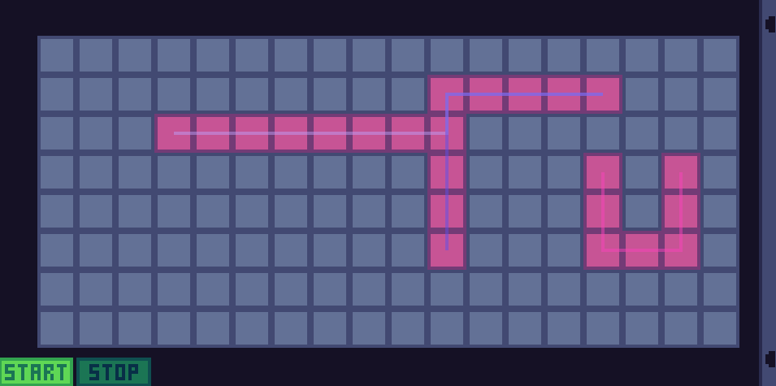

# 1000 Days
### Details
The rules are much more relaxed compared to the [original's](https://www.reddit.com/r/ThousandDays/comments/kpkszp/day_11_yes_very_embarassing/):
* The definition of a day is not strictly defined. If it goes past midnight I won't count it as a different day
* A reasonable amount of work must be done for a day to be considered as completed. For example, I can't just edit one line of code
* Code that I am required to do (i.e. not voluntary) will not be included (e.g. school projects)
* The work doesn't necessarily have to be code as long as it is something related to it. For example, drawing mockups or planning
* "===" is used to separate different projects worked on during the same day

### Days
**[Day 1:](https://github.com/mariothedog/1000-Days/blob/main/Days/Day%201/bogosort_array.cpp)** *(Streak: 1 - 2/1/2020)*
* C++
* [Bogosort algorithm](https://en.wikipedia.org/wiki/Bogosort) using arrays
* Randomly shuffles an array until it's in the correct order
* *Also: Created the repo*

**[Day 2:](https://github.com/mariothedog/1000-Days/blob/main/Days/Day%202/bogosort_vector.cpp)** *(Streak: 2 - 3/1/2020)*
* C++
* [Bogosort algorithm](https://en.wikipedia.org/wiki/Bogosort) using vectors
* Randomly shuffles a vector until it's in the correct order
* *Also: Refactored the repo and learned a bit more about references and templates*

**Day 3:** *(Streak: 3 - 4/1/2020)*
* JavaScript
* Worked on my Discord bot - [Mariothebot](https://github.com/mariothedog/Mariothebot)
* Overhauled the [add-reaction-channel](https://github.com/mariothedog/Mariothebot/blob/master/Commands/Reactions/add-reaction-channel.js) command (took way longer than it should have)  

* Updated the [tags](https://github.com/mariothedog/Mariothebot/blob/master/Commands/NSFW/tags.js) command (NSFW) to work with a more up-to-date package (previous one was deprecated)

**Day 4:** *(Streak: 4 - 5/1/2020)*
* JavaScript
* Made a new Discord bot - [RPIBot](https://github.com/mariothedog/RPIBot)
* Allows you to write to a Raspberry PI's GPIO pin (in this case, it toggles an LED)  
* I'll probably expand on this bot in later days  

**Day 5:** *(Streak: 5 - 6/1/2020)*
* JavaScript and Python
* Continued to work on [RPIBot](https://github.com/mariothedog/RPIBot)
* I made it so the bot can now be deployed on my computer but will make post requests to an HTTP server that is on my RPI
* The HTTP server was programmed in Python
* I'll add it to the repo tomorrow morning (it's getting late!)

**Day 6:** *(Streak: 6 - 7/1/2020)*
* JavaScript, Python, HTML, and a *tiny* bit of CSS
* Still working on [RPIBot](https://github.com/mariothedog/RPIBot)
* Most of the work was done on the web server  
* The website for it is now at least usable
* When the checkbox is ticked the corresponding GPIO pin will output
* There's still a lot of things that need to be cleaned up which I'll work on tomorrow:
1. It's impossible to tell what checkbox corresponds to which GPIO pin unless you know beforehand
2. If one of the GPIO pins is already outputting voltage the website won't tell the user accordingly
3. The UI is ugly
* Credit to this [script by Freenove](https://github.com/Freenove/Freenove_Ultimate_Starter_Kit_for_Raspberry_Pi/blob/master/Code/Python_Code/26.1.1_WebIO/WebIO.py) as it was really helpful with the web server  

**Day 7:** *(Streak: 7 - 8/1/2020)*
* HTML and CSS
* [RPIBot](https://github.com/mariothedog/RPIBot)
* Checkboxes now have labels (very hacky solution)  

**Day 8:** *(Streak: 8 - 9/1/2020)*
* Decided to take a break from RPIBot by doing some more C++
* [Codewars 6 Kyu Kata - Unique In Order](https://www.codewars.com/kata/54e6533c92449cc251001667)
* [Solution](https://www.codewars.com/kata/reviews/5d98f282b1415f0001893334/groups/5ffa5e8df0aa1300019d085f)

**Day 9:** *(Streak: 9 - 10/1/2020)*
* Python (Tkinter)
* This was initially for a school project but I wanted to learn a bit more about GUI so I decided to expand on it a bit
* Note that it is still a work in progress
* [Source](https://github.com/mariothedog/Basic-Pupil-Database-App)  

**Day 10:** *(Streak: 10 - 11/1/2020)*
* Python (Tkinter)
* I finished the pupil database app but it could do with a bit of refactoring
* [Source](https://github.com/mariothedog/Basic-Pupil-Database-App)  

**Day 11:** *(Streak: 11 - 12/1/2020)*
* C++
* This took me way longer than I'd care to admit (just under an hour!)... C++ is truly terrifying
* [Codewars 6 Kyu Kata - Create Phone Number](https://www.codewars.com/kata/525f50e3b73515a6db000b83/cpp)  
* [Solution](https://www.codewars.com/kata/reviews/5dd1a2d1014ee40001077b25/groups/5ffe4da3507d580001220e80)

**Day 12:** *(Streak: 12 - 13/1/2020)*
* C++
* [Codewars 6 Kyu Kata - Find the missing term in an Arithmetic Progression](https://www.codewars.com/kata/52de553ebb55d1fca3000371/cpp)  
* [Solution](https://www.codewars.com/kata/reviews/579fa0eb74cca11be3000056/groups/5fff91dcbd78f400013c4320)

**Day 13:** *(Streak: 13 - 14/1/2020)*
* JavaScript
* I learned a bit about making userscripts using Tampermonkey and made a script that adds a streak counter to [realkana](https://realkana.com)
* [Source](https://gist.github.com/mariothedog/5602eb23272109c543e99bebe05064b0)  

**Day 14:** *(Streak: 14 - 15/1/2020)*
* C++
* [Codewars 6 Kyu Kata - Are they the "same"?](https://www.codewars.com/kata/550498447451fbbd7600041c/cpp)  
* [Solution](https://www.codewars.com/kata/reviews/575e5517569d928432000003/groups/600255aa7dbf000001f9c59f)

**Day 15:** *(Streak: 15 - 16/1/2020)*
* C++
* [Codewars 6 Kyu Kata - Counting Duplicates](https://www.codewars.com/kata/54bf1c2cd5b56cc47f0007a1/cpp)  
* [Solution](https://pastebin.com/6ufa71J0)

**Day 16:** *(Streak: 16 - 17/1/2020)*
* C++
* [Codewars 6 Kyu Kata - Playing with digits](https://www.codewars.com/kata/5552101f47fc5178b1000050/cpp)  
* [Solution](https://www.codewars.com/kata/reviews/57874987d9456ea80500019f/groups/6004b91cfe09c70001f82ee6)

**Day 17:** *(Streak: 17 - 18/1/2020)*
* Python
* I'm working on a new app that that will log your spent spent on each program every day
* Currently it's very experimental as I'm still learning about the ctypes module and Windows DLLs
* [Source](https://github.com/mariothedog/Time-Tracking-App)

**Day 18:** *(Streak: 18 - 19/1/2020)*
* Python
* Working on the [time tracking app](https://github.com/mariothedog/Time-Tracking-App/tree/591d2eeca6fed6481e2a4d1fb0a2f161ab706701)
* Now using the win32gui module instead of ctypes as I find that it's much simpler
* The app now just logs all your open windows to a file
* There is no pause between each write to the log.txt file so it writes thousands of entries a second
* Seems to be pretty buggy at the moment

**Day 19:** *(Streak: 19 - 20/1/2020)*
* Python
* Working on the time tracking app(https://github.com/mariothedog/Time-Tracking-App/tree/b8c166f44c5f7c46e90f507bc2d2804f73f304d0)
* I fixed one of the issues I noticed yesterday (I thought IsIconic meant *not* minimised but now now that it means that it *is* minimized)
* Still not perfect as it logs some background processes like `Microsoft Text Input Application`
* Now only logs activity once a second so it doesn't eat up CPU
* [Learnt about cProfile](https://stackoverflow.com/a/582337/8004215) which sounds pretty useful

**Day 20:** *(Streak: 20 - 21/1/2020)*
* Python
* [Working on the time tracking app](https://github.com/mariothedog/Time-Tracking-App/tree/61b9a6529ae301f005009177a18833bdcd4ca07b)
* Now using atexit to close the log file
* Log file now uses utf-8 encoding for unicode support
* Writes process name to the log file as well now (using psutil)
* Added some more checks so not all windows get logged
* Background processes like `ApplicationFrameHost.exe`, `TextInputHost.exe`, and `Program Manager` but I'm struggling to find a way to fix that
* I'm thinking about just make it track the active window since I feel like that makes quite a bit more sense
* I think it would be cool to have the time you spent on the active window be displayed in the upper right corner of the window/near the icon/title

**Day 21:** *(Streak: 21 - 22/1/2020)*
* Python
* [Working on the time tracking app](https://github.com/mariothedog/Time-Tracking-App/tree/5ad29b012800d5c5d3d6051b18ef991af38af1fb)
* Added a window (using PyQt5) that times how long you've been on a program for
* It's not completely finished as I plan on moving the timer to the corner of the window as currently it just stays in the middle of the screen regardless of the window position
* I'll probably stop working on this after I fix this up as I found a program called [ActivityWatch](https://github.com/ActivityWatch/activitywatch) which pretty much does everything I was planning on doing and a lot more  

**Day 22:** *(Streak: 22 - 23/1/2020)*  
**Day 23:** *(Streak: 23 - 24/1/2020)*  
**Day 24:** *(Streak: 24 - 25/1/2020)*  
**Day 25:** *(Streak: 25 - 26/1/2020)*  
**Day 26:** *(Streak: 26 - 27/1/2020)*  
**Day 27:** *(Streak: 27 - 28/1/2020)*  
**Day 28:** *(Streak: 28 - 29/1/2020)*  
* GDScript (Godot Engine v3.2.3.stable.official)
* This week I participated in the [BTP Game Jam](https://itch.io/jam/blackthornprod-game-jam-3) with two other teammates ([Schweini](https://github.com/Schweini07) and [marek](https://github.com/marekmaskarinec))
* The theme of the game jam was "Less is More"
* We made a top-down procedurally generated shoot-em-up roguelike called "Life Sacrificer"
* It was based around the mechanic that sacrificing your lives (which you have 10 of in total) will grant you more upgrades
* My biggest contribution was the entities so things like player movement, the enemies, and the boss
* It was my first time using pathfinding which was very hard to get right (although I did use Godot's built-in system)
* I also learnt quite a bit more about git (first time having to use `rebase`!)
* [Available on Windows, Mac, Linux, and HTML5 here](https://schweini007.itch.io/life-sacrificer)
* [Source Code](https://github.com/Schweini07/BTP-Game-Jam)  

**Day 29:** *(Streak: 29 - 30/1/2020)*  
* Python
* The [time tracking app](https://github.com/mariothedog/Time-Tracking-App/tree/bbb3e4a7f27af6f74a5405e815e45bec4e8b258d) is now complete (for the foreseeable future)
* I found another program called [Cold Turkey Blocker](https://getcoldturkey.com/) which while time tracking isn't its main focus, it does allow you see various statistics about websites visited and applications used. It seems to be a bit more stable than ActivityWatch but unfortunately it's not open source
* I used [auto-py-to-exe](https://pypi.org/project/auto-py-to-exe/) to build the app
* [Download it here](https://github.com/mariothedog/Time-Tracking-App/releases/tag/v1.0) (most likely only works on Windows)  

**Day 30:** *(Streak: 30 - 31/1/2020)*  
* JavaScript, JavaScript, HTML, and CSS
* Back to working on [RPIBot](https://github.com/mariothedog/RPIBot)
* It took me a while but I managed to get git working on my RPI
* I also refactored the web server's HTML a bit but there is no visual difference
* I'm [trying to store the JavaScript in an external file](https://github.com/mariothedog/RPIBot/tree/35653d69dba9ab684e08abfd53676854d1e75da5) but it's not going well

**Day 31:** *(Streak: 31 - 1/2/2020)*  
* JavaScript, Python, HTML
* [RPIBot](https://github.com/mariothedog/RPIBot/tree/1655d61cfea21bc4e91a158ded8089e3d25b634f)
* One month done!
* I made a lot of progress today
* I'm now using Flask for the web server which allowed me to use an external file for both the JavaScript and the css
* I'm now also using jQuery (AJAX) for making post requests from the web page back to the Flask server
* The bot's `toggle` command now actually does what its name implies. When you use it you don't have to specify a write value. If the pin is already on, it will turn off, and vice versa

**Day 32:** *(Streak: 32 - 2/2/2020)*  
* JavaScript, HTML, and CSS
* [RPIBot](https://github.com/mariothedog/RPIBot/commit/48ea284f9af366409c90faaa67bd9cb0082c9f61)
* The position of the checkboxes is no longer hardcoded and now uses a [flexbox](https://www.w3schools.com/css/css3_flexbox.asp) and `margin-right` instead
* Clicking the text now also toggles the checkbox as well as just clicking the checkbox directly (using a `label` tag)

**Day 33:** *(Streak: 33 - 3/2/2020)*  
* Python
* I didn't have much free time today so all I worked on was this Codewars Kata
* I haven't finished it yet as my solution isn't efficient enough
* [Codewars 5 Kyu Kata - Gap in Primes](https://www.codewars.com/kata/561e9c843a2ef5a40c0000a4/python)  
* [Solution](https://www.codewars.com/kata/reviews/561ea274e41ebb191e00001c/groups/601bf11dd02c870001b817d4)

**Day 34:** *(Streak: 34 - 4/2/2020)*  
* Python
* Same Kata but this time it's finished
* I'm quite proud of my solution even though it feels like I'm cheating
* What I did was I generated the first 1100000 prime numbers at the beginning of the program (surprisingly fast, only took about 0.1 seconds) and since then used the `gap` method to *just* check the gaps
* It's quite efficient since the prime numbers are only calculated once and can then be used for every test case
* However, this method relies on the fact that the upper limit (of `n`) is `1100000`
* [Codewars 5 Kyu Kata - Gap in Primes](https://www.codewars.com/kata/561e9c843a2ef5a40c0000a4/python)  
* [Solution](https://www.codewars.com/kata/reviews/561ea274e41ebb191e00001c/groups/601bf11dd02c870001b817d4)  
===
* JavaScript
* [RPIBot](https://github.com/mariothedog/RPIBot/tree/e1fb88e56e3c286fba6ffda1bcae723be0dc1836)
* Added a `states` command which tells the user the state of every GPIO pin  

**Day 35:** *(Streak: 35 - 5/2/2020)*  
* RPIBot
* No changes to its code
* All I did was I connected an LED bar graph to my RPI

**Day 36:** *(Streak: 36 - 6/2/2020)*  
* GDScript (Godot Engine v3.2.3.stable.official)
* Experimented with steering behavior
* Credit to GDScript for their [helpful tutorial series](https://www.youtube.com/playlist?list=PLhqJJNjsQ7KFYRNAk9O95x8E4dJSdaheq) on it
* [Source](https://github.com/mariothedog/Steering-AI/tree/773f976bce50914ab77b8fd8c0352886e5a6549c)

**Day 37:** *(Streak: 37 - 7/2/2020)*  
* JavaScript
* [RPIBot](https://github.com/mariothedog/RPIBot/tree/22ef0a362028550eacb0073120b3124efff3d84e)
* Added a bunch of commands related to displaying binary on my LED Bar Graph
* I plan on turning it into a binary calculator within the next few days (I'm not sure how many operators I'll add yet)
* 37 in binary (100101):

**Day 38:** *(Streak: 38 - 8/2/2020)*  
* GDScript (Godot Engine v3.2.3.stable.official)
* [Working on a new project to simulate natural selection](https://github.com/mariothedog/Natural-Selection/tree/e6d07f1001a0cc03a55de3a221c60ce3b3867786)
* Currently the little guys just run around a box and don't do much else  

**Day 39:** *(Streak: 39 - 9/2/2020)*  
* JavaScript
* [RPIBot](https://github.com/mariothedog/RPIBot/tree/43df90f2752a0f2437eb0a15025c8d3f419e563f)
* I did a lot of refactoring today
* Added a `get-bits-number` command which just converts the binary on the LED bar graph into 

**Day 40:** *(Streak: 40 - 10/2/2020)*  
* GDScript (Godot Engine v3.2.3.stable.official)
* [Natural Selection Simulation](https://github.com/mariothedog/Natural-Selection/tree/3526331a6581dbe6b2be3abc66d02b156ae3ceba)
* There's actually some natural selection going on now
* Currently only the speed property mutates which unsurprisingly rises over time (there are no repercussions to having a really high speed)
* I think the time scale property might be a bit buggy but I'm not entirely sure  

**Day 41:** *(Streak: 41 - 11/2/2020)*  
* Python
* [Codewars 6 Kyu Kata - Pairs of Bears](https://www.codewars.com/kata/57d165ad95497ea150000020)
* [Solution](https://www.codewars.com/kata/reviews/5de92d5610dfae00012aa90c/groups/602311b7b6e12c000175b009)

**Day 42:** *(Streak: 42 - 12/2/2020)*  
* JavaScript
* [RPIBot](https://github.com/mariothedog/RPIBot/tree/674f599abc0afba97eda755483a255845bcd918a)
* Added a command that adds numbers on the binary display
* There's an optional transition parameter which makes it so the calculation isn't instant
* Counting from 0 to 127 (2^7 - 1):  

**Day 43:** *(Streak: 43 - 13/2/2020)*  
* GDScript (Godot Engine v3.2.3.stable.official)
* [Natural Selection Simulation](https://github.com/mariothedog/Natural-Selection/commit/84dd80f53bfe59167c9efff92d08114c86d5621b)
* Added some graphs
* The one on the right is for population while the one on the left is for the population's average speed
* The graphs aren't very descriptive currently but some general trends are still noticable:
* Average speed tends to gradually increase over time
* When population spikes it tends to drop rapidly shortly afterwards  

**Day 44:** *(Streak: 44 - 14/2/2020)*  
* JavaScript
* [RPIBot](https://github.com/mariothedog/RPIBot/tree/2df3e5f05f649e9a599b3c199ae8af284b38e7f0)
* I added a `calculate-bits-number` command which simplifies an arithmetic expression and then displays it
* I used [mathjs](https://mathjs.org/) so it wasn't too difficult to implement  
  
===
* I'm entering the [first Brackeys Game Jam of 2021](https://itch.io/jam/brackeys-5)
* [Source](https://github.com/mariothedog/brackeys-game-jam/tree/b918b2b32ec2fce1d793061921acb15377c0df9e)
* I plan on making a tower defence-like game
* I added a drag and drop mechanic to the towers
* You can't move them once you have placed them currently  

**Day 45:** *(Streak: 45 - 15/2/2020)*  
* GDScript (Godot Engine v3.2.3.stable.official)
* [Natural Selection Simulation](https://github.com/mariothedog/Natural-Selection/tree/7b47039a54f488415063a6fb932cecceabfd95e9)
* I fixed some bugs related to the time scale input GUI
* I spent a while trying to fix the time scale determinism issues but I couldn't find a solution  
===
* GDScript (Godot Engine v3.2.3.stable.official)
* [Brackeys Game Jam Entry](https://github.com/mariothedog/brackeys-game-jam/tree/e54e9cc0957ac8d04d7404daf3896e976ed9f599)
* Towers can now be:
1. Moved once placed
2. Put back into the inventory
3. Towers can now be merged to create stronger turrets (currently represented by a bigger gun)
4. Added a start button which causes turrets to shoot every second (merged turrets don't change yet)  

**Day 46:** *(Streak: 46 - 16/2/2020)*  
* GDScript (Godot Engine v3.2.3.stable.official)
* [Brackeys Game Jam Entry](https://github.com/mariothedog/brackeys-game-jam/tree/0d402dc48b3f76b817eacbaca3863d6aa9c5ed24)  

**Day 47:** *(Streak: 47 - 17/2/2020)*  
* GDScript (Godot Engine v3.2.3.stable.official)
* [Brackeys Game Jam Entry](https://github.com/mariothedog/brackeys-game-jam/tree/910d192a3aa9c9d1897a5c5294f34701915e9751)  

**Day 48:** *(Streak: 48 - 18/2/2020)*  
* GDScript (Godot Engine v3.2.3.stable.official)
* [Brackeys Game Jam Entry](https://github.com/mariothedog/brackeys-game-jam/tree/0b63a016d5c00cc685135fae2535d106584e1dd5)  

**Day 49:** *(Streak: 49 - 19/2/2020)*  
* GDScript (Godot Engine v3.2.3.stable.official)
* [Brackeys Game Jam Entry](https://github.com/mariothedog/brackeys-game-jam/tree/3776d417467bc19765e592a51d72046227a58ea7)  
  
===
* Python
* I experimented a bit with matplotlib using [this tutorial](https://youtu.be/UO98lJQ3QGI)

**Day 50:** *(Streak: 50 - 20/2/2020)*  
* GDScript (Godot Engine v3.2.3.stable.official)
* [Brackeys Game Jam Entry](https://github.com/mariothedog/brackeys-game-jam/tree/cb03ec3060f19e503c73959ee0805ff948f0c98c)
* I polished it up a bit and I made 10 levels and one infinite level after that

**Day 51:** *(Streak: 51 - 21/2/2020)*  
* GDScript (Godot Engine v3.2.3.stable.official)
* [Brackeys Game Jam Entry](https://github.com/mariothedog/brackeys-game-jam/tree/7742bc5ae2f13bad46aea111ac5e7c3162613b75)
* I added sound effects
* I was planning on adding music but the piece I wrote was really bad so I just scrapped it
* The game has a name now - "Simultaneous Turrets"
* You can play it [here (HTML5, Windows, Mac, and Linux)](https://mariothedog.itch.io/simultaneous-turrets)
* [Video walkthrough](https://www.youtube.com/watch?v=OLE0pTRPYTA)

**Day 52:** *(Streak: 52 - 22/2/2020)*  
* It's been a few (5!!) days since I last updated this - sorry about that! Fortunately, my streak is still going strong
* Python
* [Codewars 6 Kyu Kata - Simple Fun #132: Number Of Carries](https://www.codewars.com/kata/58a6568827f9546931000027)
* [Solution](https://www.codewars.com/kata/reviews/58e48937d1c6cd5490000060/groups/60347fafe89cdf0001d0c62f)

**Day 53:** *(Streak: 53 - 23/2/2020)*  
* Git (does this even count?) and GDScript (Godot Engine v3.2.3.stable.official)
* [Simultaneous Turrets](https://github.com/mariothedog/simultaneous-turrets/tree/a6df5ebe709fee33f5bc29cfabca5df20872684a)
* I didn't do much today aside from preparing the simultaneous turrets repo for the post-jam version
* I'll be remaking the game from scratch since a lot of things need to be refactored and redesigned

**Day 54:** *(Streak: 54 - 24/2/2020)*  
* GDScript (Godot Engine v3.2.3.stable.official)
* [Simultaneous Turrets](https://github.com/mariothedog/simultaneous-turrets/tree/41af226145dbf8abf697a1586a8c8280b0ec6a19)
* I added a basic level editor
* It pretty much just saves the tilemap data to a resource file

**Day 55:** *(Streak: 55 - 25/2/2020)*  
* GDScript (Godot Engine v3.2.3.stable.official)
* [Simultaneous Turrets](https://github.com/mariothedog/simultaneous-turrets/tree/711fbd8f0ad3a654daf265f53fedfbaeb922e610)
* I added some things in preparation for the enemy path tiles but they're not very interesting

**Day 56:** *(Streak: 56 - 26/2/2020)*  
* GDScript (Godot Engine v3.2.3.stable.official)
* [Simultaneous Turrets](https://github.com/mariothedog/simultaneous-turrets/tree/c643ccb5f8f5b728cfce40a4e41fea89a6f209a1)
* Lots of progress on the enemy paths today
* I added A\* pathfinding which generates every path from every enemy start position to every enemy end position
* 3 enemy paths:  

**Day 57:** *(Streak: 57 - 27/2/2020)*  
* GDScript (Godot Engine v3.2.3.stable.official)
* [Simultaneous Turrets](https://github.com/mariothedog/simultaneous-turrets/tree/3db403f0a7b0d91c395628f44ed3ecc58c666df2)
* I added enemies that follow the paths  

**Day 58:** *(Streak: 58 - 28/2/2020)*  
* GDScript (Godot Engine v3.2.3.stable.official)
* [Simultaneous Turrets](https://github.com/mariothedog/simultaneous-turrets/tree/b4fa85ce4417303ef9cc67c50c78d3da06140474)
* Work in progress inventory  

**Day 59:** *(Streak: 59 - 1/3/2020)*  
* GDScript (Godot Engine v3.2.3.stable.official)
* [Simultaneous Turrets](https://github.com/mariothedog/simultaneous-turrets/tree/89d58d92c8c687f253fe15ee92fa46fc36b7f456)
* Redesigned the inventory
* Also experimented a lot with making fonts  

**Day 60:** *(Streak: 60 - 2/3/2020)*  
* GDScript (Godot Engine v3.2.3.stable.official)
* [Simultaneous Turrets](https://github.com/mariothedog/simultaneous-turrets/tree/ae7fb9775b0c37cbe73a5ac23f5f0dc3734a6c12)
* Inventory that slides in and out  

**Day 61:** *(Streak: 61 - 3/3/2020)*  
* GDScript (Godot Engine v3.2.3.stable.official)
* [Simultaneous Turrets](https://github.com/mariothedog/simultaneous-turrets/tree/37ec43e70dcc0cdec8c97506f39dc179bf97818d)
* Basic drag and drop UI  

**Day 62:** *(Streak: 62 - 4/3/2020)*  
* GDScript (Godot Engine v3.2.3.stable.official)
* [Simultaneous Turrets](https://github.com/mariothedog/simultaneous-turrets/tree/a637b22f92c7dd10d91fe45aea470a458d9e10b0)
* Turret snapping
* Turret aiming  

**Day 63:** *(Streak: 63 - 5/3/2020)*  
* GDScript (Godot Engine v3.2.3.stable.official)
* [Simultaneous Turrets](https://github.com/mariothedog/simultaneous-turrets/tree/d49eda4a3d7c9c6de52370c594dd3cc78a3635bd)
* Turret shooting  

**Day 64:** *(Streak: 64 - 6/3/2020)*  
* GDScript (Godot Engine v3.2.3.stable.official)
* [Simultaneous Turrets](https://github.com/mariothedog/simultaneous-turrets/tree/b701dff0b5c65e36e1f0ee0be81e5b4e2fb370b4)
* Just some inventory bug fixes  

**Day 65:** *(Streak: 65 - 7/3/2020)*  
* GDScript (Godot Engine v3.2.3.stable.official)
* [Simultaneous Turrets](https://github.com/mariothedog/simultaneous-turrets/tree/6ceee09280f7ce303342de37baf85376780f034d)
* I made a [postmortem for the game jam](https://mariothedog.itch.io/simultaneous-turrets/devlog/229253/jam-postmortem)
* Turret sightlines
* Spent a long time trying to fix [this issue](https://github.com/godotengine/godot/issues/46788) (and failed)

**Day 66:** *(Streak: 66 - 8/3/2020)*  
* GDScript (Godot Engine v3.2.3.stable.official)
* [Simultaneous Turrets](https://github.com/mariothedog/simultaneous-turrets/tree/ba005e5db227b81b5f6286a3071fda840ac1c284)
* Small improvements and bug fixes
* Made [another devlog](https://mariothedog.itch.io/simultaneous-turrets/devlog/229821/my-thoughts-on-a-post-jam-version)  

**Day 67:** *(Streak: 67 - 9/3/2020)*  
* GDScript (Godot Engine v3.2.3.stable.official)
* [Simultaneous Turrets](https://github.com/mariothedog/simultaneous-turrets/tree/61cdf6ec8d602e38f0ebeb5bcfc54d2ac6016887)
* Added a (currently useless) start and stop button  

**Day 68:** *(Streak: 68 - 10/3/2020)*  
* GDScript (Godot Engine v3.2.3.stable.official)
* [Simultaneous Turrets](https://github.com/mariothedog/simultaneous-turrets/tree/4e181b2f4522cd71d73dc71441affa73c8cdcd5d)
* Gave the start/stop buttons some functionality  

**Day 69:** *(Streak: 69 - 11/3/2020)*  
* GDScript (Godot Engine v3.2.3.stable.official)
* [Simultaneous Turrets](https://github.com/mariothedog/simultaneous-turrets/tree/c5c011090bdf48e6c4894b5c45f74c917b4ef3a2)
* Fixed a few bugs  

**Day 70:** *(Streak: 70 - 12/3/2020)*  
* GDScript (Godot Engine v3.2.3.stable.official)
* [Simultaneous Turrets](https://github.com/mariothedog/simultaneous-turrets/tree/b4c626579748c3d38bd4179de3ba8ac04ce71d20)
* Added turret merging but currently all it does is change the gun sprite  

**Day 71:** *(Streak: 71 - 13/3/2020)*  
* GDScript (Godot Engine v3.2.3.stable.official)
* [Simultaneous Turrets](https://github.com/mariothedog/simultaneous-turrets/tree/c791c5168b9ac828ff40b6cc888b1b772925e77d)
* Fixed bug where you could merge more than 8 turrets
* Added sight lines and bullets based on turret level
* Stopped bullets from being able to collide with each other
* Made enemy colliders move instantly while the sprite still lerps (should hopefully remove any possible determinism issues)
* Fixed a bug where the enemy spawn order could change
* Added enemy spawn indicators
* Added a base tile (if the enemy touches it you lose)  

**Day 72:** *(Streak: 72 - 14/3/2020)* (Happy π day)
* GDScript (Godot Engine v3.2.3.stable.official)
* [Simultaneous Turrets](https://github.com/mariothedog/simultaneous-turrets/tree/2cc1395a1b15369fe61533c12639d00f6f8752ca)
* Added health
* Fixed a load of bugs
* Devlog: https://mariothedog.itch.io/simultaneous-turrets/devlog/231822/combining-turrets-and-death  

**Day 73:** *(Streak: 73 - 15/3/2020)*
* GDScript (Godot Engine v3.2.3.stable.official)
* [Simultaneous Turrets](https://github.com/mariothedog/simultaneous-turrets/tree/bf83210f0ca9dd7c4348fd2aac218ad2bd2dca7c)
* Added changing the enemy path order in the level editor  

**Day 74:** *(Streak: 74 - 16/3/2020)*
* GDScript (Godot Engine v3.2.3.stable.official)
* [Simultaneous Turrets](https://github.com/mariothedog/simultaneous-turrets/tree/f87466a875dd6425b584f3d56cba7f64f3a8097b)
* Added changing the number of lives you have to the level editor
* Refactored a few things
* I tried timing bullets to the step timer on a different branch (https://github.com/mariothedog/simultaneous-turrets/tree/384a0bfc1c21fffbcace409c5c50cf5ff4ef8194)
* I tried using lasers instead of bullets on a different branch (https://github.com/mariothedog/simultaneous-turrets/tree/0f11d4ab7e79762a68cd2ea9ba1a198ab133385d)

**Day 75:** *(Streak: 75 - 17/3/2020)*
* GDScript (Godot Engine v3.2.3.stable.official)
* [Simultaneous Turrets](https://github.com/mariothedog/simultaneous-turrets/tree/66ac30541fcd8e15348e1c3207b6819b63c37e3a)
* Refactored some things
* Fixed a few bugs
* Added a finite number of turrets
* Added a finite number of enemies
* Adding changing the level's resource path in the level editor
* Copied over the game jam version's first level
* Added a level counter to the HUD  

**Day 76:** *(Streak: 76 - 18/3/2020)*
* GDScript (Godot Engine v3.2.3.stable.official)
* [Simultaneous Turrets](https://github.com/mariothedog/simultaneous-turrets/tree/f8a83b05444fec4387039dbcacc4f99b4ee89942)
* Copied over the game jam version's second level (technically this was done yesterday but I pushed it today)
* Added automatic level changing after a level is completed
* Removed the debug path lines
* Fixed a turret rotation bug (I ***really*** hope this is the last time I have to fix one of these)  

**Day 77:** *(Streak: 77 - 19/3/2020)*
* GDScript (Godot Engine v3.2.3.stable.official)
* [Simultaneous Turrets](https://github.com/mariothedog/simultaneous-turrets/tree/3f0307cd7e9bf2575febe351ea923fa812ded462)
* Currently the game feels very different to the jam version which I'm trying to fix
* I tried making enemies move 2 tiles at a time but currently it's very experimental

**Day 78:** *(Streak: 78 - 20/3/2020)*
* GDScript (Godot Engine v3.2.3.stable.official)
* [Simultaneous Turrets](https://github.com/mariothedog/simultaneous-turrets/tree/c830f0ced4b4e9264b4899891fabdc60c1431e9b)
* I made enemies move every 0.5 seconds which I think feels a bit better than yesterday's version
* I fixed a bug where turrets couldn't be selected if they were on a leftmost tile
* I also fixed another turret rotation bug and I'm pretty confident that I won't have to fix this again
* I added the experimental bullet timing which is very buggy and feels quite laggy (despite it not actually being laggy)  

**Day 79:** *(Streak: 79 - 21/3/2020)*
* GDScript (Godot Engine v3.2.3.stable.official)
* [Simultaneous Turrets](https://github.com/mariothedog/simultaneous-turrets/tree/dfba0f9911e2b1703853ab5dda934993d5ef2d56)
* I fixed a bug with the experimental bullet timing but it still feels quite off
* I also experimented with moving the colliders smoothly as well (https://github.com/mariothedog/simultaneous-turrets/tree/0f2300164b3a0594885e672118b0575639b92117) 
* Devlog:  https://mariothedog.itch.io/simultaneous-turrets/devlog/234235/timed-bullets-and-level-improvements

**Day 80:** *(Streak: 80 - 22/3/2020)*
* GDScript (Godot Engine v3.2.3.stable.official)
* I was working on Simultaneous Turrets but I'm switching between branches a lot since it's all very experimental
* [Experimental timing 1 branch](https://github.com/mariothedog/simultaneous-turrets/tree/42d8cb4a6c42ff754fe33ed302130d0f2620e772)
* [Experimental timing 3 branch](https://github.com/mariothedog/simultaneous-turrets/tree/99c312ac2bb639b474cb840109ba3ebddb03db9b)
* [Experimental timing 4 branch](https://github.com/mariothedog/simultaneous-turrets/tree/55847d56d310a685dbe423583e68185b642f5ac3)
* (We don't talk about the experimental timing 2 branch)

**Day 81:** *(Streak: 81 - 23/3/2020)*
* GDScript (Godot Engine v3.2.3.stable.official)
* I was working on Simultaneous Turrets but like with yesterday, it's very experimental. I didn't actually commit anything today but I assure you, I have been working on it
* I've tried out a lot of different ideas and I'm starting to think timed bullets (e.g. bullets move one tile per second) are a bad dea
* I don't really like the "stacking" effect they create (when bullets go a long time without hitting an enemy so there is just a long chain of bullets which can then kill multiple enemies in a row) but I'm still not sure if I want to remove it or not
* I'm also thinking about using hitscan projectiles

**Day 82:** *(Streak: 82 - 24/3/2020)*
* GDScript (Godot Engine v3.2.3.stable.official)
* [Simultaneous Turrets](https://github.com/mariothedog/simultaneous-turrets/tree/f71aa1efe9ec70f0fc04e86b462698bac343dca0)
* I didn't do much today but I did create *another* new branch (this is getting very confusing)
* All I did was I removed the timed bullets which I thought about doing yesterday

**Day 83:** *(Streak: 83 - 25/3/2020)*
* GDScript (Godot Engine v3.2.3.stable.official)
* [Simultaneous Turrets](https://github.com/mariothedog/simultaneous-turrets/tree/4ac911021f1deeded29436a8e69ed592f9881c52)
* I added back the enemy collider's instant movement from tile-to-tile
* I experimented a bit with adding a delay before turrets shoot bullets so that enemies move then turrets shoot (the delay only happens when there is an enemy in front of the turret). I don't really like how it turned out though. I'll definitely need to experiment with it a bit more

**Day 84:** *(Streak: 84 - 26/3/2020)*
* GDScript (Godot Engine v3.2.3.stable.official)
* [Simultaneous Turrets](https://github.com/mariothedog/simultaneous-turrets/tree/c45721c3357f094bfec4244df844aee575c0937e)
* I didn't do much today but I did revert the experimental turret shooting delay
* I'm going to experiment with a hitscan-type thing with the bullets tomorrow but I'm not really sure how it will go

**Day 85:** *(Streak: 85 - 27/3/2020)*
* GDScript (Godot Engine v3.2.3.stable.official)
* Simultaneous Turrets
* [Experimental timing 6](https://github.com/mariothedog/simultaneous-turrets/tree/c9c51532538fb7ca962fc6f0d855905df233ee94):
* I experimented with hitscan like I mentioned yesterday by trying to use a raycast as a way to verify that the enemy that the bullet is colliding with is really the first enemy in front of the bullet
* I don't really like how it turned out though and the commit I made is still filled with commented out code
* [Experimental timing 7](https://github.com/mariothedog/simultaneous-turrets/tree/cbe4ebee38e3d010bca9136963cf21fb42a64625):
* I added back smooth enemy collider movement (for like the 80th time)
* I made it so a bullet's speed was measured in tiles/second instead of pixels/second. Currently bullets move 25 tiles/second (which is 300 pixels/s)
* I made a design doc but it's quite empty at the moment: https://docs.google.com/document/d/1mG--18b3iOtmumqtHXNJIOKp0vuaAl71bZtf9eAatU4/edit?usp=sharing
* I'm starting to think that maybe making the game turn-based is a bad idea
* [Experimental timing 8](https://github.com/mariothedog/simultaneous-turrets/tree/40a56936e58c920a0a7578c050c2dae8dabf9a73):
* I honestly cannot remember what this branch is even supposed to do

**Day 86:** *(Streak: 86 - 28/3/2020)*
* GDScript (Godot Engine v3.2.3.stable.official)
* [Simultaneous Turrets](https://github.com/mariothedog/simultaneous-turrets/tree/62ea87a84de61cb2d5d158fa1ab27192f6a2820f)
* Devlog: https://mariothedog.itch.io/simultaneous-turrets/devlog/236683/timing-and-lots-of-experimentation
* Woohoo, new branch: experimental timing number 9
* I added a delay so that turrets only shoot after enemies have moved
* ... I then later removed that delay
* I added back timed bullets - but this time with a twist
* *Everything* is done in some weird instruction-based pattern-like format
* I actually quite like how it turned out but it's difficult to explain so just look:  

**Day 87:** *(Streak: 87 - 29/3/2020)*
* GDScript (Godot Engine v3.2.3.stable.official)
* [Simultaneous Turrets](https://github.com/mariothedog/simultaneous-turrets/tree/f5d27ef78f8295f39a8a351c0eda64943c24171d)
* I fixed the turret rotation bug ***again***. I know I said that I was confident I had fixed it last time but this time I'm like extra confident. (I am going to throw a temper tantrum if this is not fixed)
* I merged the experimental-timing-9 branch into timing and then timing into main but I haven't deleted any of the branches yet. I'm too scared that I'll need to go back and use the stuff from those other branches so I'm going to leave them up for at least a week
* I added steps to the level editor:  

**Day 88:** *(Streak: 88 - 30/3/2020)*
* GDScript (Godot Engine v3.2.3.stable.official)
* [Simultaneous Turrets](https://github.com/mariothedog/simultaneous-turrets/tree/ee17a79906150b4e9134c7fb0b45843da4dcbe58)
* Balanced levels 0-2
* Made it so enemies move before a new one spawns
* Refactored some things
* Add level loading to the level editor

**Day 89:** *(Streak: 89 - 31/3/2020)*
* GDScript (Godot Engine v3.2.3.stable.official)
* [Simultaneous Turrets](https://github.com/mariothedog/simultaneous-turrets/tree/b73d5ae3270757824c6da4018febe1785895b42d)
* I fixed some bugs that occur when playing the game with a really high step rate. I tested it with a wait time of 0.001 seconds (so each turn lasts 1 millisecond) and it *seems* to be bug-free
* I made level 1 completable with only 1 turret. I'm quite proud of this as it's actually slower (i.e. it takes more turns) if you use only one turret so it's like an act of balancing efficiency (number of turrets) and speed (number of turns)
* To do this, I made the level 1 enemies spawn in groups 3 and changed the number of enemies to 4 total. The way I did this was quite hacky but I plan on improving this tomorrow
* I was planning on experimenting with moving bullets 3 tiles *in one turn* but I didn't end up doing it. I might try it out tomorrow

**Day 90:** *(Streak: 90 - 1/4/2020)* (Happy April fools day)
* GDScript (Godot Engine v3.2.3.stable.official)
* [Simultaneous Turrets](https://github.com/mariothedog/simultaneous-turrets/tree/f76ce41e16b60eeabcbf66cc8e4e14b64cc5e602)
* I added enemy group sizes so e.g. 3 enemies will spawn then there will be a gap then another 3 will spawn
* I made consecutive bullet move steps happen in one turn
* I made bullets spawn on the tile that the turret is on instead of on the tile ahead of the turret
* I added a turret shoot animation but currently it's very experimental. I also reverted the thing above to do this but I think I'll add it back tomorrow  

**Day 91:** *(Streak: 91 - 2/4/2020)*
* GDScript (Godot Engine v3.2.3.stable.official)
* [Simultaneous Turrets](https://github.com/mariothedog/simultaneous-turrets/tree/5b6f92b6e05d1e476e84a41b46c7772f8c6e3d31)
* I made bullet move steps that occur after a turret shoot step happen on the same turn as the turret shoot step
* I tidied up the turret shoot animation and I think it looks really good (despite its simplicity)
* I might add particle effects or something tomorrow and then I'll probably merge it with main
* Note that the gif makes the animation look slightly worse  

**Day 92:** *(Streak: 92 - 3/4/2020)*
* GDScript (Godot Engine v3.2.3.stable.official)
* [Simultaneous Turrets](https://github.com/mariothedog/simultaneous-turrets/tree/1db9d576113e1006769b134e0f8b5539b295fc21)
* Enemy turns are now skipped if there are no enemy paths
* The game waits till the current step has been completed before starting a new one. This fixes some animation issues that occurred when playing at a high step rate. It should also make the game more deterministic
* I feel like this might make syncing the music hard as each step lasts a different amount of time. I made it so there's a delay of 0.1 second after each turn before the next one but I might change it so that it works in a padding-like fashion instead. So for example, if a turn lasted 0.3 seconds I could pad 0.2 seconds to make it last 0.5 seconds total. If it lasted 0.1 seconds then I could pad 0.4 seconds to make it last 0.5 seconds as well. (So all turns would last 0.5 seconds.) And if a turn exceeded 0.5 seconds it would just be left alone  

**Day 93:** *(Streak: 93 - 4/4/2020)*
* GDScript (Godot Engine v3.2.3.stable.official)
* [Simultaneous Turrets](https://github.com/mariothedog/simultaneous-turrets/tree/0c03aad1ac6ec94d2d6f8f1c20f51fb172cf648b)
* Enemy turns are now skipped if there are no enemy paths
* I added the "step delay padding" I talked about yesterday. Each turn lasts a minimum of 0.5 seconds now
* I added a speed up button but it's still quite buggy. Sometimes it causes bullets to phase through enemies
* I added level 3 but I feel like it's quite boring. I might make some changes to it later on
* Devlog: https://mariothedog.itch.io/simultaneous-turrets/devlog/239081/level-balancing-and-shooting-animations  

**Day 94:** *(Streak: 94 - 5/4/2020)*
* GDScript (Godot Engine v3.2.3.stable.official)
* [Simultaneous Turrets](https://github.com/mariothedog/simultaneous-turrets/tree/251289d269f207c741774811170f0e77023acbaf)
* I made it so the turret shoot animation starts on the turn before the tuuret shoot step
* I also fixed a bunch of bugs that came along with it although I feel like some of them might have already been there and I just hadn't noticed

**Day 95:** *(Streak: 95 - 6/4/2020)*
* GDScript (Godot Engine v3.2.3.stable.official)
* [Simultaneous Turrets](https://github.com/mariothedog/simultaneous-turrets/tree/a242db87bdd7c869f7d10aa2371fd50abe6eed72)
* I'm refactoring the way the game handles steps
* It's still far from being finished

**Day 96:** *(Streak: 96 - 7/4/2020)*
* GDScript (Godot Engine v3.2.3.stable.official)
* [Simultaneous Turrets](https://github.com/mariothedog/simultaneous-turrets/tree/5ac02df1d4ced47284d5d76d9db50e54cd4eb0e9)
* I'm still refactoring but I think I'll be done tomorrow

**Day 97:** *(Streak: 97 - 8/4/2020)*
* GDScript (Godot Engine v3.2.3.stable.official)
* [Simultaneous Turrets](https://github.com/mariothedog/simultaneous-turrets/tree/958ca5775ec3eab02cbd2bbe8123c8a981258aab)
* Finished the refactoring
* Fixed the speed up button by making it so the bullet uses a raycast instead (points from the start pos to the current pos)
* It still breaks when the min step delay is too short (<= 6 ms in my testing) but I don't think it's anything to worry about

**Day 98:** *(Streak: 98 - 9/4/2020)*
* GDScript (Godot Engine v3.2.3.stable.official)
* [Simultaneous Turrets](https://github.com/mariothedog/simultaneous-turrets/tree/fb31d375d175eba3dc1615e642194e971c073f96)
* I made it so enemy steps can merge
* I haven't merged it with main yet but I think I will tomorrow (I might make some changes)  

**Day 99:** *(Streak: 99 - 10/4/2020)*
* GDScript (Godot Engine v3.2.3.stable.official)
* [Simultaneous Turrets](https://github.com/mariothedog/simultaneous-turrets/tree/ae178ba126e91c5b3654e51b12386057dd84dbb5)
* I added a trail of enemy colliders to prevent fast enemies jumping over bullets (sort of like I did with the bullets)
* The enemy move step used to check if the last enemy had stopped moving before emitting the finished signal. I did it this way as I was under the assumption that the last enemy would always finish moving last but this was not the case. It's possible it could have happened in other situations but I know if the base tile is involved sometimes the last enemy can finish a little bit sooner than the other enemies. I changed it so it waited till every enemy has stopped moving
* I also made this change with the bullets. I'm not sure if this bug affects them or not but just in case I decided to fix it anyways (+ I think it's more explicit anyways)  

**Day 100:** *(Streak: 100 - 11/4/2020)* (100th day! 1/10th of the way there!)
* GDScript (Godot Engine v3.2.3.stable.official)
* [Simultaneous Turrets](https://github.com/mariothedog/simultaneous-turrets/tree/af194d19aade1d5a6945293fd6fe679c634787d7)
* I experimented a bit with a new level 3 but it's still just a work in progress
* I feel like the enemy movement is too fast so I tried making it so enemies move at the same speed. I also made it decellerate when it's reaching the end but it feels a bit weird at the moment (it becomes really slow so it takes ages to reach the last tile). It's all very experimental at the moment though (https://github.com/mariothedog/simultaneous-turrets/tree/baa85f60041d3ab442470318f76bee0769e414f5)
* I made another experimental branch where I removed step merging as it feels a bit strange how enemies can go from moving 1 tile at a time to moving 2 tiles at a time despite moving at the same speed relative to everything else (https://github.com/mariothedog/simultaneous-turrets/tree/a8d9712b947412b06cfdea15f3d68f27387cde2e)
* I think I mentioned this before but I feel like the game is deviating way too much from the jam version and I don't like that. One thing that stands out to me is that I don't like how things are very "continuous". For example, bullets just stop moving which seems a bit strange.
* Devlog: https://mariothedog.itch.io/simultaneous-turrets/devlog/241643/faster-gameplay-merging-enemy-steps-and-deviating-from-the-jam-version  

**Day 101:** *(Streak: 101 - 12/4/2020)*
* Python
* I didn't have much time today so all I did was a Codewars Kata
* [Codewars 6 Kyu Kata - Sum of Digits/Digital Root](https://www.codewars.com/kata/541c8630095125aba6000c00)

**Day 102:** *(Streak: 102 - 13/4/2020)*
* Python
* I had more free time than yesterday so me not working on Simultaneous Turrets today was completely my fault (I was procrastinating)
* [Codewars 6 Kyu Kata - Find the odd int](https://www.codewars.com/kata/54da5a58ea159efa38000836)
* [Codewars 6 Kyu Kata - Persistent Bugger](https://www.codewars.com/kata/55bf01e5a717a0d57e0000ec)
* [Codewars 5 Kyu Kata - Diophantine Equation](https://www.codewars.com/kata/554f76dca89983cc400000bb) (Not completed yet, not efficient enough)

**Day 103:** *(Streak: 103 - 14/4/2020)*
* Simultaneous Turrets Game Design
* I didn't actually write or create anything but I was looking for advice on the Godot Discord server and it seems like some RTS games are actually turn-based but the turns are really fast so you can't notice it (I'll probably try this out)

**Day 104:** *(Streak: 104 - 15/4/2020)*
* Python
* [Codewars 6 Kyu Kata - Count the smiley faces!](https://www.codewars.com/kata/reviews/588d0231aac675bf56001ac2/groups/6078fd0e124b500001bff78b)

**Day 105:** *(Streak: 105 - 16/4/2020)*
* Python
* [Codewars 5 Kyu Kata - String incrementer](https://www.codewars.com/kata/reviews/554cef99085cd8c9720000d9/groups/607a0df4b42a890001dcb66a)

**Day 106:** *(Streak: 106 - 17/4/2020)*
* Python
* [Codewars 5 Kyu Kata - Valid Parentheses](https://www.codewars.com/kata/reviews/557730efe9be66fc1b00011b/groups/607a8679ae8fcb0001883adc)

**Day 107:** *(Streak: 107 - 18/4/2020)*
* Python
* [Codewars 5 Kyu Kata - The Hashtag Generator](https://www.codewars.com/kata/52449b062fb80683ec000024)
* [Codewars 5 Kyu Kata - The Hashtag Generator](https://www.codewars.com/kata/52449b062fb80683ec000024) (Second solution)
