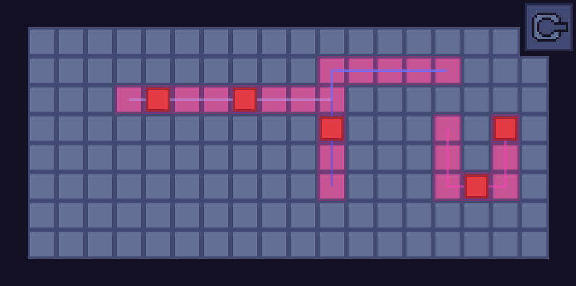

# 1000 Days
### Details
The rules are much more relaxed compared to the [original's](https://www.reddit.com/r/ThousandDays/comments/kpkszp/day_11_yes_very_embarassing/):
* The definition of a day is not strictly defined. If it goes past midnight I won't count it as a different day
* A reasonable amount of work must be done for a day to be considered as completed. For example, I can't just edit one line of code
* Code that I am required to do (i.e. not voluntary) will not be included (e.g. school projects)
* The work doesn't necessarily have to be code as long as it is something related to it. For example, drawing mockups or planning
* "===" is used to separate different projects worked on during the same day

### Days
**[Day 1:](https://github.com/mariothedog/1000-Days/blob/main/Days/Day%201/bogosort_array.cpp)** *(Streak: 1 - 2/1/2020)*
* C++
* [Bogosort algorithm](https://en.wikipedia.org/wiki/Bogosort) using arrays
* Randomly shuffles an array until it's in the correct order
* *Also: Created the repo*

**[Day 2:](https://github.com/mariothedog/1000-Days/blob/main/Days/Day%202/bogosort_vector.cpp)** *(Streak: 2 - 3/1/2020)*
* C++
* [Bogosort algorithm](https://en.wikipedia.org/wiki/Bogosort) using vectors
* Randomly shuffles a vector until it's in the correct order
* *Also: Refactored the repo and learned a bit more about references and templates*

**Day 3:** *(Streak: 3 - 4/1/2020)*
* JavaScript
* Worked on my Discord bot - [Mariothebot](https://github.com/mariothedog/Mariothebot)
* Overhauled the [add-reaction-channel](https://github.com/mariothedog/Mariothebot/blob/master/Commands/Reactions/add-reaction-channel.js) command (took way longer than it should have)  

* Updated the [tags](https://github.com/mariothedog/Mariothebot/blob/master/Commands/NSFW/tags.js) command (NSFW) to work with a more up-to-date package (previous one was deprecated)

**Day 4:** *(Streak: 4 - 5/1/2020)*
* JavaScript
* Made a new Discord bot - [RPIBot](https://github.com/mariothedog/RPIBot)
* Allows you to write to a Raspberry PI's GPIO pin (in this case, it toggles an LED)  
* I'll probably expand on this bot in later days  

**Day 5:** *(Streak: 5 - 6/1/2020)*
* JavaScript and Python
* Continued to work on [RPIBot](https://github.com/mariothedog/RPIBot)
* I made it so the bot can now be deployed on my computer but will make post requests to an HTTP server that is on my RPI
* The HTTP server was programmed in Python
* I'll add it to the repo tomorrow morning (it's getting late!)

**Day 6:** *(Streak: 6 - 7/1/2020)*
* JavaScript, Python, HTML, and a *tiny* bit of CSS
* Still working on [RPIBot](https://github.com/mariothedog/RPIBot)
* Most of the work was done on the web server  
* The website for it is now at least usable
* When the checkbox is ticked the corresponding GPIO pin will output
* There's still a lot of things that need to be cleaned up which I'll work on tomorrow:
1. It's impossible to tell what checkbox corresponds to which GPIO pin unless you know beforehand
2. If one of the GPIO pins is already outputting voltage the website won't tell the user accordingly
3. The UI is ugly
* Credit to this [script by Freenove](https://github.com/Freenove/Freenove_Ultimate_Starter_Kit_for_Raspberry_Pi/blob/master/Code/Python_Code/26.1.1_WebIO/WebIO.py) as it was really helpful with the web server  

**Day 7:** *(Streak: 7 - 8/1/2020)*
* HTML and CSS
* [RPIBot](https://github.com/mariothedog/RPIBot)
* Checkboxes now have labels (very hacky solution)  

**Day 8:** *(Streak: 8 - 9/1/2020)*
* Decided to take a break from RPIBot by doing some more C++
* [Codewars 6 Kyu Kata - Unique In Order](https://www.codewars.com/kata/54e6533c92449cc251001667)
* [Solution](https://www.codewars.com/kata/reviews/5d98f282b1415f0001893334/groups/5ffa5e8df0aa1300019d085f)

**Day 9:** *(Streak: 9 - 10/1/2020)*
* Python (Tkinter)
* This was initially for a school project but I wanted to learn a bit more about GUI so I decided to expand on it a bit
* Note that it is still a work in progress
* [Source](https://github.com/mariothedog/Basic-Pupil-Database-App)  

**Day 10:** *(Streak: 10 - 11/1/2020)*
* Python (Tkinter)
* I finished the pupil database app but it could do with a bit of refactoring
* [Source](https://github.com/mariothedog/Basic-Pupil-Database-App)  

**Day 11:** *(Streak: 11 - 12/1/2020)*
* C++
* This took me way longer than I'd care to admit (just under an hour!)... C++ is truly terrifying
* [Codewars 6 Kyu Kata - Create Phone Number](https://www.codewars.com/kata/525f50e3b73515a6db000b83/cpp)  
* [Solution](https://www.codewars.com/kata/reviews/5dd1a2d1014ee40001077b25/groups/5ffe4da3507d580001220e80)

**Day 12:** *(Streak: 12 - 13/1/2020)*
* C++
* [Codewars 6 Kyu Kata - Find the missing term in an Arithmetic Progression](https://www.codewars.com/kata/52de553ebb55d1fca3000371/cpp)  
* [Solution](https://www.codewars.com/kata/reviews/579fa0eb74cca11be3000056/groups/5fff91dcbd78f400013c4320)

**Day 13:** *(Streak: 13 - 14/1/2020)*
* JavaScript
* I learned a bit about making userscripts using Tampermonkey and made a script that adds a streak counter to [realkana](https://realkana.com)
* [Source](https://gist.github.com/mariothedog/5602eb23272109c543e99bebe05064b0)  

**Day 14:** *(Streak: 14 - 15/1/2020)*
* C++
* [Codewars 6 Kyu Kata - Are they the "same"?](https://www.codewars.com/kata/550498447451fbbd7600041c/cpp)  
* [Solution](https://www.codewars.com/kata/reviews/575e5517569d928432000003/groups/600255aa7dbf000001f9c59f)

**Day 15:** *(Streak: 15 - 16/1/2020)*
* C++
* [Codewars 6 Kyu Kata - Counting Duplicates](https://www.codewars.com/kata/54bf1c2cd5b56cc47f0007a1/cpp)  
* [Solution](https://pastebin.com/6ufa71J0)

**Day 16:** *(Streak: 16 - 17/1/2020)*
* C++
* [Codewars 6 Kyu Kata - Playing with digits](https://www.codewars.com/kata/5552101f47fc5178b1000050/cpp)  
* [Solution](https://www.codewars.com/kata/reviews/57874987d9456ea80500019f/groups/6004b91cfe09c70001f82ee6)

**Day 17:** *(Streak: 17 - 18/1/2020)*
* Python
* I'm working on a new app that that will log your spent spent on each program every day
* Currently it's very experimental as I'm still learning about the ctypes module and Windows DLLs
* [Source](https://github.com/mariothedog/Time-Tracking-App)

**Day 18:** *(Streak: 18 - 19/1/2020)*
* Python
* Working on the [time tracking app](https://github.com/mariothedog/Time-Tracking-App/tree/591d2eeca6fed6481e2a4d1fb0a2f161ab706701)
* Now using the win32gui module instead of ctypes as I find that it's much simpler
* The app now just logs all your open windows to a file
* There is no pause between each write to the log.txt file so it writes thousands of entries a second
* Seems to be pretty buggy at the moment

**Day 19:** *(Streak: 19 - 20/1/2020)*
* Python
* Working on the time tracking app(https://github.com/mariothedog/Time-Tracking-App/tree/b8c166f44c5f7c46e90f507bc2d2804f73f304d0)
* I fixed one of the issues I noticed yesterday (I thought IsIconic meant *not* minimised but now now that it means that it *is* minimized)
* Still not perfect as it logs some background processes like `Microsoft Text Input Application`
* Now only logs activity once a second so it doesn't eat up CPU
* [Learnt about cProfile](https://stackoverflow.com/a/582337/8004215) which sounds pretty useful

**Day 20:** *(Streak: 20 - 21/1/2020)*
* Python
* [Working on the time tracking app](https://github.com/mariothedog/Time-Tracking-App/tree/61b9a6529ae301f005009177a18833bdcd4ca07b)
* Now using atexit to close the log file
* Log file now uses utf-8 encoding for unicode support
* Writes process name to the log file as well now (using psutil)
* Added some more checks so not all windows get logged
* Background processes like `ApplicationFrameHost.exe`, `TextInputHost.exe`, and `Program Manager` but I'm struggling to find a way to fix that
* I'm thinking about just make it track the active window since I feel like that makes quite a bit more sense
* I think it would be cool to have the time you spent on the active window be displayed in the upper right corner of the window/near the icon/title

**Day 21:** *(Streak: 21 - 22/1/2020)*
* Python
* [Working on the time tracking app](https://github.com/mariothedog/Time-Tracking-App/tree/5ad29b012800d5c5d3d6051b18ef991af38af1fb)
* Added a window (using PyQt5) that times how long you've been on a program for
* It's not completely finished as I plan on moving the timer to the corner of the window as currently it just stays in the middle of the screen regardless of the window position
* I'll probably stop working on this after I fix this up as I found a program called [ActivityWatch](https://github.com/ActivityWatch/activitywatch) which pretty much does everything I was planning on doing and a lot more  

**Day 22:** *(Streak: 22 - 23/1/2020)*  
**Day 23:** *(Streak: 23 - 24/1/2020)*  
**Day 24:** *(Streak: 24 - 25/1/2020)*  
**Day 25:** *(Streak: 25 - 26/1/2020)*  
**Day 26:** *(Streak: 26 - 27/1/2020)*  
**Day 27:** *(Streak: 27 - 28/1/2020)*  
**Day 28:** *(Streak: 28 - 29/1/2020)*  
* GDScript (Godot Engine v3.2.3.stable.official)
* This week I participated in the [BTP Game Jam](https://itch.io/jam/blackthornprod-game-jam-3) with two other teammates ([Schweini](https://github.com/Schweini07) and [marek](https://github.com/marekmaskarinec))
* The theme of the game jam was "Less is More"
* We made a top-down procedurally generated shoot-em-up roguelike called "Life Sacrificer"
* It was based around the mechanic that sacrificing your lives (which you have 10 of in total) will grant you more upgrades
* My biggest contribution was the entities so things like player movement, the enemies, and the boss
* It was my first time using pathfinding which was very hard to get right (although I did use Godot's built-in system)
* I also learnt quite a bit more about git (first time having to use `rebase`!)
* [Available on Windows, Mac, Linux, and HTML5 here](https://schweini007.itch.io/life-sacrificer)
* [Source Code](https://github.com/Schweini07/BTP-Game-Jam)  

**Day 29:** *(Streak: 29 - 30/1/2020)*  
* Python
* The [time tracking app](https://github.com/mariothedog/Time-Tracking-App/tree/bbb3e4a7f27af6f74a5405e815e45bec4e8b258d) is now complete (for the foreseeable future)
* I found another program called [Cold Turkey Blocker](https://getcoldturkey.com/) which while time tracking isn't its main focus, it does allow you see various statistics about websites visited and applications used. It seems to be a bit more stable than ActivityWatch but unfortunately it's not open source
* I used [auto-py-to-exe](https://pypi.org/project/auto-py-to-exe/) to build the app
* [Download it here](https://github.com/mariothedog/Time-Tracking-App/releases/tag/v1.0) (most likely only works on Windows)  

**Day 30:** *(Streak: 30 - 31/1/2020)*  
* JavaScript, JavaScript, HTML, and CSS
* Back to working on [RPIBot](https://github.com/mariothedog/RPIBot)
* It took me a while but I managed to get git working on my RPI
* I also refactored the web server's HTML a bit but there is no visual difference
* I'm [trying to store the JavaScript in an external file](https://github.com/mariothedog/RPIBot/tree/35653d69dba9ab684e08abfd53676854d1e75da5) but it's not going well

**Day 31:** *(Streak: 31 - 1/2/2020)*  
* JavaScript, Python, HTML
* [RPIBot](https://github.com/mariothedog/RPIBot/tree/1655d61cfea21bc4e91a158ded8089e3d25b634f)
* One month done!
* I made a lot of progress today
* I'm now using Flask for the web server which allowed me to use an external file for both the JavaScript and the css
* I'm now also using jQuery (AJAX) for making post requests from the web page back to the Flask server
* The bot's `toggle` command now actually does what its name implies. When you use it you don't have to specify a write value. If the pin is already on, it will turn off, and vice versa

**Day 32:** *(Streak: 32 - 2/2/2020)*  
* JavaScript, HTML, and CSS
* [RPIBot](https://github.com/mariothedog/RPIBot/commit/48ea284f9af366409c90faaa67bd9cb0082c9f61)
* The position of the checkboxes is no longer hardcoded and now uses a [flexbox](https://www.w3schools.com/css/css3_flexbox.asp) and `margin-right` instead
* Clicking the text now also toggles the checkbox as well as just clicking the checkbox directly (using a `label` tag)

**Day 33:** *(Streak: 33 - 3/2/2020)*  
* Python
* I didn't have much free time today so all I worked on was this Codewars Kata
* I haven't finished it yet as my solution isn't efficient enough
* [Codewars 5 Kyu Kata - Gap in Primes](https://www.codewars.com/kata/561e9c843a2ef5a40c0000a4/python)  
* [Solution](https://www.codewars.com/kata/reviews/561ea274e41ebb191e00001c/groups/601bf11dd02c870001b817d4)

**Day 34:** *(Streak: 34 - 4/2/2020)*  
* Python
* Same Kata but this time it's finished
* I'm quite proud of my solution even though it feels like I'm cheating
* What I did was I generated the first 1100000 prime numbers at the beginning of the program (surprisingly fast, only took about 0.1 seconds) and since then used the `gap` method to *just* check the gaps
* It's quite efficient since the prime numbers are only calculated once and can then be used for every test case
* However, this method relies on the fact that the upper limit (of `n`) is `1100000`
* [Codewars 5 Kyu Kata - Gap in Primes](https://www.codewars.com/kata/561e9c843a2ef5a40c0000a4/python)  
* [Solution](https://www.codewars.com/kata/reviews/561ea274e41ebb191e00001c/groups/601bf11dd02c870001b817d4)  
===
* JavaScript
* [RPIBot](https://github.com/mariothedog/RPIBot/tree/e1fb88e56e3c286fba6ffda1bcae723be0dc1836)
* Added a `states` command which tells the user the state of every GPIO pin  

**Day 35:** *(Streak: 35 - 5/2/2020)*  
* RPIBot
* No changes to its code
* All I did was I connected an LED bar graph to my RPI

**Day 36:** *(Streak: 36 - 6/2/2020)*  
* GDScript (Godot Engine v3.2.3.stable.official)
* Experimented with steering behavior
* Credit to GDScript for their [helpful tutorial series](https://www.youtube.com/playlist?list=PLhqJJNjsQ7KFYRNAk9O95x8E4dJSdaheq) on it
* [Source](https://github.com/mariothedog/Steering-AI/tree/773f976bce50914ab77b8fd8c0352886e5a6549c)

**Day 37:** *(Streak: 37 - 7/2/2020)*  
* JavaScript
* [RPIBot](https://github.com/mariothedog/RPIBot/tree/22ef0a362028550eacb0073120b3124efff3d84e)
* Added a bunch of commands related to displaying binary on my LED Bar Graph
* I plan on turning it into a binary calculator within the next few days (I'm not sure how many operators I'll add yet)
* 37 in binary (100101):

**Day 38:** *(Streak: 38 - 8/2/2020)*  
* GDScript (Godot Engine v3.2.3.stable.official)
* [Working on a new project to simulate natural selection](https://github.com/mariothedog/Natural-Selection/tree/e6d07f1001a0cc03a55de3a221c60ce3b3867786)
* Currently the little guys just run around a box and don't do much else  

**Day 39:** *(Streak: 39 - 9/2/2020)*  
* JavaScript
* [RPIBot](https://github.com/mariothedog/RPIBot/tree/43df90f2752a0f2437eb0a15025c8d3f419e563f)
* I did a lot of refactoring today
* Added a `get-bits-number` command which just converts the binary on the LED bar graph into 

**Day 40:** *(Streak: 40 - 10/2/2020)*  
* GDScript (Godot Engine v3.2.3.stable.official)
* [Natural Selection Simulation](https://github.com/mariothedog/Natural-Selection/tree/3526331a6581dbe6b2be3abc66d02b156ae3ceba)
* There's actually some natural selection going on now
* Currently only the speed property mutates which unsurprisingly rises over time (there are no repercussions to having a really high speed)
* I think the time scale property might be a bit buggy but I'm not entirely sure  

**Day 41:** *(Streak: 41 - 11/2/2020)*  
* Python
* [Codewars 6 Kyu Kata - Pairs of Bears](https://www.codewars.com/kata/57d165ad95497ea150000020)
* [Solution](https://www.codewars.com/kata/reviews/5de92d5610dfae00012aa90c/groups/602311b7b6e12c000175b009)

**Day 42:** *(Streak: 42 - 12/2/2020)*  
* JavaScript
* [RPIBot](https://github.com/mariothedog/RPIBot/tree/674f599abc0afba97eda755483a255845bcd918a)
* Added a command that adds numbers on the binary display
* There's an optional transition parameter which makes it so the calculation isn't instant
* Counting from 0 to 127 (2^7 - 1):  

**Day 43:** *(Streak: 43 - 13/2/2020)*  
* GDScript (Godot Engine v3.2.3.stable.official)
* [Natural Selection Simulation](https://github.com/mariothedog/Natural-Selection/commit/84dd80f53bfe59167c9efff92d08114c86d5621b)
* Added some graphs
* The one on the right is for population while the one on the left is for the population's average speed
* The graphs aren't very descriptive currently but some general trends are still noticable:
* Average speed tends to gradually increase over time
* When population spikes it tends to drop rapidly shortly afterwards  

**Day 44:** *(Streak: 44 - 14/2/2020)*  
* JavaScript
* [RPIBot](https://github.com/mariothedog/RPIBot/tree/2df3e5f05f649e9a599b3c199ae8af284b38e7f0)
* I added a `calculate-bits-number` command which simplifies an arithmetic expression and then displays it
* I used [mathjs](https://mathjs.org/) so it wasn't too difficult to implement  
  
===
* I'm entering the [first Brackeys Game Jam of 2021](https://itch.io/jam/brackeys-5)
* [Source](https://github.com/mariothedog/brackeys-game-jam/tree/b918b2b32ec2fce1d793061921acb15377c0df9e)
* I plan on making a tower defence-like game
* I added a drag and drop mechanic to the towers
* You can't move them once you have placed them currently  

**Day 45:** *(Streak: 45 - 15/2/2020)*  
* GDScript (Godot Engine v3.2.3.stable.official)
* [Natural Selection Simulation](https://github.com/mariothedog/Natural-Selection/tree/7b47039a54f488415063a6fb932cecceabfd95e9)
* I fixed some bugs related to the time scale input GUI
* I spent a while trying to fix the time scale determinism issues but I couldn't find a solution  
===
* GDScript (Godot Engine v3.2.3.stable.official)
* [Brackeys Game Jam Entry](https://github.com/mariothedog/brackeys-game-jam/tree/e54e9cc0957ac8d04d7404daf3896e976ed9f599)
* Towers can now be:
1. Moved once placed
2. Put back into the inventory
3. Towers can now be merged to create stronger turrets (currently represented by a bigger gun)
4. Added a start button which causes turrets to shoot every second (merged turrets don't change yet)  

**Day 46:** *(Streak: 46 - 16/2/2020)*  
* GDScript (Godot Engine v3.2.3.stable.official)
* [Brackeys Game Jam Entry](https://github.com/mariothedog/brackeys-game-jam/tree/0d402dc48b3f76b817eacbaca3863d6aa9c5ed24)  

**Day 47:** *(Streak: 47 - 17/2/2020)*  
* GDScript (Godot Engine v3.2.3.stable.official)
* [Brackeys Game Jam Entry](https://github.com/mariothedog/brackeys-game-jam/tree/910d192a3aa9c9d1897a5c5294f34701915e9751)  

**Day 48:** *(Streak: 48 - 18/2/2020)*  
* GDScript (Godot Engine v3.2.3.stable.official)
* [Brackeys Game Jam Entry](https://github.com/mariothedog/brackeys-game-jam/tree/0b63a016d5c00cc685135fae2535d106584e1dd5)  

**Day 49:** *(Streak: 49 - 19/2/2020)*  
* GDScript (Godot Engine v3.2.3.stable.official)
* [Brackeys Game Jam Entry](https://github.com/mariothedog/brackeys-game-jam/tree/3776d417467bc19765e592a51d72046227a58ea7)  
  
===
* Python
* I experimented a bit with matplotlib using [this tutorial](https://youtu.be/UO98lJQ3QGI)

**Day 50:** *(Streak: 50 - 20/2/2020)*  
* GDScript (Godot Engine v3.2.3.stable.official)
* [Brackeys Game Jam Entry](https://github.com/mariothedog/brackeys-game-jam/tree/cb03ec3060f19e503c73959ee0805ff948f0c98c)
* I polished it up a bit and I made 10 levels and one infinite level after that

**Day 51:** *(Streak: 51 - 21/2/2020)*  
* GDScript (Godot Engine v3.2.3.stable.official)
* [Brackeys Game Jam Entry](https://github.com/mariothedog/brackeys-game-jam/tree/7742bc5ae2f13bad46aea111ac5e7c3162613b75)
* I added sound effects
* I was planning on adding music but the piece I wrote was really bad so I just scrapped it
* The game has a name now - "Simultaneous Turrets"
* You can play it [here (HTML5, Windows, Mac, and Linux)](https://mariothedog.itch.io/simultaneous-turrets)
* [Video walkthrough](https://www.youtube.com/watch?v=OLE0pTRPYTA)

**Day 52:** *(Streak: 52 - 22/2/2020)*  
* It's been a few (5!!) days since I last updated this - sorry about that! Fortunately, my streak is still going strong
* Python
* [Codewars 6 Kyu Kata - Simple Fun #132: Number Of Carries](https://www.codewars.com/kata/58a6568827f9546931000027)
* [Solution](https://www.codewars.com/kata/reviews/58e48937d1c6cd5490000060/groups/60347fafe89cdf0001d0c62f)

**Day 53:** *(Streak: 53 - 23/2/2020)*  
* Git (does this even count?) and GDScript (Godot Engine v3.2.3.stable.official)
* [Simultaneous Turrets](https://github.com/mariothedog/simultaneous-turrets/tree/a6df5ebe709fee33f5bc29cfabca5df20872684a)
* I didn't do much today aside from preparing the simultaneous turrets repo for the post-jam version
* I'll be remaking the game from scratch since a lot of things need to be refactored and redesigned

**Day 54:** *(Streak: 54 - 24/2/2020)*  
* GDScript (Godot Engine v3.2.3.stable.official)
* [Simultaneous Turrets](https://github.com/mariothedog/simultaneous-turrets/tree/41af226145dbf8abf697a1586a8c8280b0ec6a19)
* I added a basic level editor
* It pretty much just saves the tilemap data to a resource file

**Day 55:** *(Streak: 55 - 25/2/2020)*  
* GDScript (Godot Engine v3.2.3.stable.official)
* [Simultaneous Turrets](https://github.com/mariothedog/simultaneous-turrets/tree/711fbd8f0ad3a654daf265f53fedfbaeb922e610)
* I added some things in preparation for the enemy path tiles but they're not very interesting

**Day 56:** *(Streak: 56 - 26/2/2020)*  
* GDScript (Godot Engine v3.2.3.stable.official)
* [Simultaneous Turrets](https://github.com/mariothedog/simultaneous-turrets/tree/c643ccb5f8f5b728cfce40a4e41fea89a6f209a1)
* Lots of progress on the enemy paths today
* I added A\* pathfinding which generates every path from every enemy start position to every enemy end position
* 3 enemy paths:  

**Day 57:** *(Streak: 57 - 27/2/2020)*  
* GDScript (Godot Engine v3.2.3.stable.official)
* [Simultaneous Turrets](https://github.com/mariothedog/simultaneous-turrets/tree/3db403f0a7b0d91c395628f44ed3ecc58c666df2)
* I added enemies that follow the paths  

**Day 58:** *(Streak: 58 - 28/2/2020)*  
* GDScript (Godot Engine v3.2.3.stable.official)
* [Simultaneous Turrets](https://github.com/mariothedog/simultaneous-turrets/tree/b4fa85ce4417303ef9cc67c50c78d3da06140474)
* Work in progress inventory  

**Day 59:** *(Streak: 59 - 1/3/2020)*  
* GDScript (Godot Engine v3.2.3.stable.official)
* [Simultaneous Turrets](https://github.com/mariothedog/simultaneous-turrets/tree/89d58d92c8c687f253fe15ee92fa46fc36b7f456)
* Redesigned the inventory
* Also experimented a lot with making fonts  

**Day 60:** *(Streak: 60 - 2/3/2020)*  
* GDScript (Godot Engine v3.2.3.stable.official)
* [Simultaneous Turrets](https://github.com/mariothedog/simultaneous-turrets/tree/ae7fb9775b0c37cbe73a5ac23f5f0dc3734a6c12)
* Inventory that slides in and out  

**Day 61:** *(Streak: 61 - 3/3/2020)*  
* GDScript (Godot Engine v3.2.3.stable.official)
* [Simultaneous Turrets](https://github.com/mariothedog/simultaneous-turrets/tree/37ec43e70dcc0cdec8c97506f39dc179bf97818d)
* Basic drag and drop UI  

**Day 62:** *(Streak: 62 - 4/3/2020)*  
* GDScript (Godot Engine v3.2.3.stable.official)
* [Simultaneous Turrets](https://github.com/mariothedog/simultaneous-turrets/tree/a637b22f92c7dd10d91fe45aea470a458d9e10b0)
* Turret snapping
* Turret aiming  

**Day 63:** *(Streak: 63 - 5/3/2020)*  
* GDScript (Godot Engine v3.2.3.stable.official)
* [Simultaneous Turrets](https://github.com/mariothedog/simultaneous-turrets/tree/d49eda4a3d7c9c6de52370c594dd3cc78a3635bd)
* Turret shooting  

**Day 64:** *(Streak: 64 - 6/3/2020)*  
* GDScript (Godot Engine v3.2.3.stable.official)
* [Simultaneous Turrets](https://github.com/mariothedog/simultaneous-turrets/tree/b701dff0b5c65e36e1f0ee0be81e5b4e2fb370b4)
* Just some inventory bug fixes  

**Day 65:** *(Streak: 65 - 7/3/2020)*  
* GDScript (Godot Engine v3.2.3.stable.official)
* [Simultaneous Turrets](https://github.com/mariothedog/simultaneous-turrets/tree/6ceee09280f7ce303342de37baf85376780f034d)
* I made a [postmortem for the game jam](https://mariothedog.itch.io/simultaneous-turrets/devlog/229253/jam-postmortem)
* Turret sightlines
* Spent a long time trying to fix [this issue](https://github.com/godotengine/godot/issues/46788) (and failed)

**Day 66:** *(Streak: 66 - 8/3/2020)*  
* GDScript (Godot Engine v3.2.3.stable.official)
* [Simultaneous Turrets](https://github.com/mariothedog/simultaneous-turrets/tree/ba005e5db227b81b5f6286a3071fda840ac1c284)
* Small improvements and bug fixes
* Made [another devlog](https://mariothedog.itch.io/simultaneous-turrets/devlog/229821/my-thoughts-on-a-post-jam-version)  

**Day 67:** *(Streak: 67 - 9/3/2020)*  
* GDScript (Godot Engine v3.2.3.stable.official)
* [Simultaneous Turrets](https://github.com/mariothedog/simultaneous-turrets/tree/61cdf6ec8d602e38f0ebeb5bcfc54d2ac6016887)
* Added a (currently useless) start and stop button  

**Day 68:** *(Streak: 68 - 10/3/2020)*  
* GDScript (Godot Engine v3.2.3.stable.official)
* [Simultaneous Turrets](https://github.com/mariothedog/simultaneous-turrets/tree/4e181b2f4522cd71d73dc71441affa73c8cdcd5d)
* Gave the start/stop buttons some functionality  

**Day 69:** *(Streak: 69 - 11/3/2020)*  
* GDScript (Godot Engine v3.2.3.stable.official)
* [Simultaneous Turrets](https://github.com/mariothedog/simultaneous-turrets/tree/c5c011090bdf48e6c4894b5c45f74c917b4ef3a2)
* Fixed a few bugs  

**Day 70:** *(Streak: 70 - 12/3/2020)*  
* GDScript (Godot Engine v3.2.3.stable.official)
* [Simultaneous Turrets](https://github.com/mariothedog/simultaneous-turrets/tree/b4c626579748c3d38bd4179de3ba8ac04ce71d20)
* Added turret merging but currently all it does is change the gun sprite  

**Day 71:** *(Streak: 71 - 13/3/2020)*  
* GDScript (Godot Engine v3.2.3.stable.official)
* [Simultaneous Turrets](https://github.com/mariothedog/simultaneous-turrets/tree/c791c5168b9ac828ff40b6cc888b1b772925e77d)
* Fixed bug where you could merge more than 8 turrets
* Added sight lines and bullets based on turret level
* Stopped bullets from being able to collide with each other
* Made enemy colliders move instantly while the sprite still lerps (should hopefully remove any possible determinism issues)
* Fixed a bug where the enemy spawn order could change
* Added enemy spawn indicators
* Added a base tile (if the enemy touches it you lose)  

**Day 72:** *(Streak: 72 - 14/3/2020)*  (Happy π day)
* GDScript (Godot Engine v3.2.3.stable.official)
* [Simultaneous Turrets](https://github.com/mariothedog/simultaneous-turrets/tree/2cc1395a1b15369fe61533c12639d00f6f8752ca)
* Added health
* Fixed a load of bugs
* Devlog: https://mariothedog.itch.io/simultaneous-turrets/devlog/231822/combining-turrets-and-death  

**Day 73:** *(Streak: 73 - 15/3/2020)*
* GDScript (Godot Engine v3.2.3.stable.official)
* [Simultaneous Turrets](https://github.com/mariothedog/simultaneous-turrets/tree/bf83210f0ca9dd7c4348fd2aac218ad2bd2dca7c)
* Added changing the enemy path order in the level editor  

**Day 74:** *(Streak: 74 - 16/3/2020)*
* GDScript (Godot Engine v3.2.3.stable.official)
* [Simultaneous Turrets](https://github.com/mariothedog/simultaneous-turrets/tree/f87466a875dd6425b584f3d56cba7f64f3a8097b)
* Added changing the number of lives you have to the level editor
* Refactored a few things
